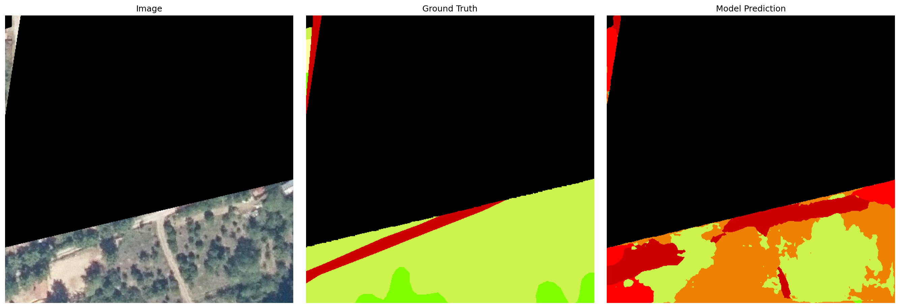
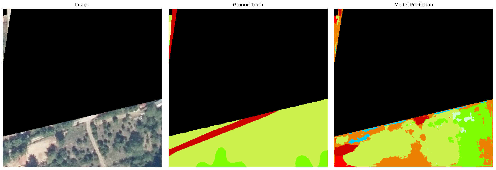
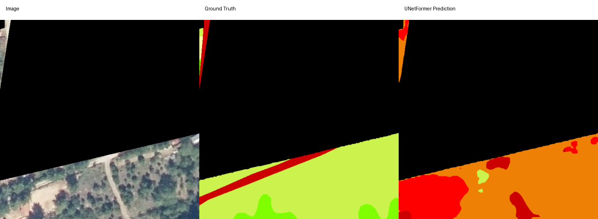
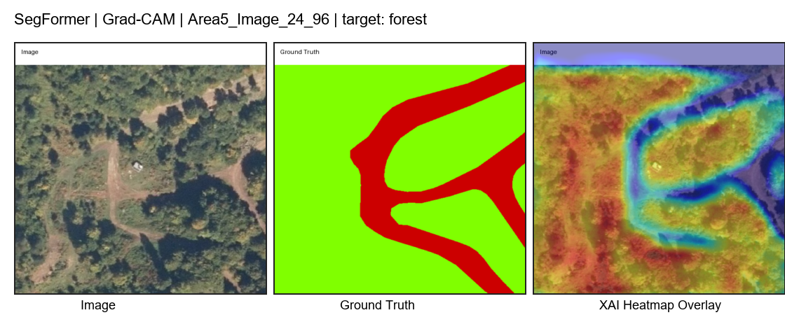
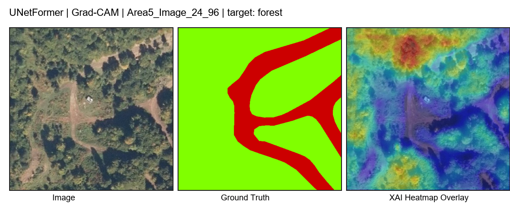

# Aerial Segmentation Dataset

## Dataset Description

This repository presents documentation, experiment scripts, and model results for an aerial semantic segmentation dataset used for land-cover mapping with deep learning models.

The dataset is organized into training, validation, and test splits. Each split contains paired `images/` and `masks/` folders. The training set includes 8,383 image-mask pairs, the validation set includes 1,794 image-mask pairs, and the test set includes 1,802 image-mask pairs.

The segmentation labels include the following classes:

| ID | Class |
|:--:|:------|
| 0 | background |
| 1 | hazelnut |
| 2 | forest |
| 3 | permanent_cropland |
| 4 | greenhouse |
| 5 | grassland |
| 6 | sparsely_vegetated_areas |
| 7 | arable_land |
| 8 | discontinuous_urban_fabric |
| 9 | road_and_rail_networks |
| 10 | water_courses |
| 11 | water_bodies |
| 12 | wetland |

## Evaluated Models

The dataset has been evaluated using CNN-based and transformer-based semantic segmentation models:

- **DeepLabV3+** 
- **SegFormer** 
- **UNet++** 
- **UNetFormer** 
## Metric Results and Weights

The table below summarizes the test-set performance of each model. Metrics are reported as mean Intersection over Union (`mIoU`), mean F1 score (`mF1`), and overall accuracy (`OA`).

| Model | mIoU | mF1 | OA |
|:------|-----:|----:|---:|
| SegFormer | 0.667829 | 0.775170 | 0.889268 |
| DeepLabV3+ | 0.547540 | 0.654405 | 0.878137 |
| UNet++ | 0.466644 | 0.558940 | 0.876426 |
| UNetFormer | 0.343530 | 0.416225 | 0.844012 |

Detailed per-class metrics are available under [`results/metrics`](results/metrics). Confusion matrices are available under [`results/confusion_matrices`](results/confusion_matrices).

Model weights are not tracked directly in this repository because trained checkpoint files are large. They should be shared separately through a release asset or external storage such as Google Drive.

## Visual Results

Example prediction outputs are provided under [`figures/sample_predictions`](figures/sample_predictions).

### DeepLabV3+



### UNet++



### UNetFormer



## Explainable AI Results

Selected XAI visualizations are provided under [`figures/xai`](figures/xai).

### SegFormer Grad-CAM



### UNetFormer Grad-CAM



## Repository Structure

```text
AerialSegmentationDataset/
|-- docs/
|-- figures/
|   |-- sample_predictions/
|   `-- xai/
|-- results/
|   |-- confusion_matrices/
|   `-- metrics/
`-- scripts/
    |-- deeplabv3plus/
    |-- segformer/
    |-- unetplusplus/
    `-- unetformer/
```

## Reproducibility

The original local dataset path used for these experiments was:

```text
C:\Users\CBS-7\Desktop\FINDIK_PROJE\AERIAL_DATA_CIKTILAR\splitted2\splitted2
```

Expected dataset layout:

```text
dataset_root/
|-- train/
|   |-- images/
|   `-- masks/
|-- val/
|   |-- images/
|   `-- masks/
`-- test/
    |-- images/
    `-- masks/
```

Training and testing scripts are available in [`scripts`](scripts). Before running a model, update dataset and checkpoint paths inside the relevant PowerShell or Python scripts according to your local environment.

## Citation

If you use this dataset documentation, code, or model results in your research, please cite this repository.
